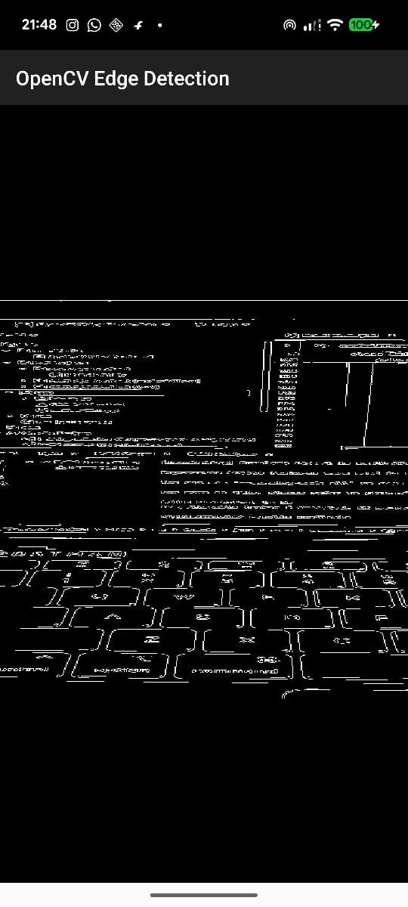
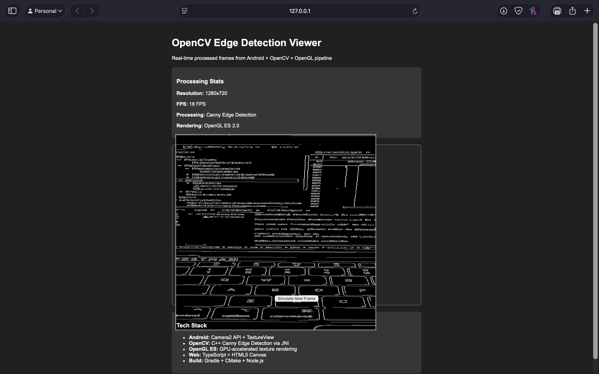

# Android OpenCV Edge Detection with OpenGL and Web Viewer

Real-time edge detection application using Android Camera2 API, OpenCV C++ processing via JNI, OpenGL ES rendering, and TypeScript web viewer for demonstration.


## Features Implemented

### Android Application
- Real-time camera feed capture using Camera2 API and ImageReader
- Frame processing with OpenCV Canny Edge Detection in C++ via JNI
- GPU-accelerated rendering using OpenGL ES 2.0 with vertex/fragment shaders
- Proper camera orientation handling with texture coordinate rotation
- Real-time performance at 15-20 FPS for 1280x720 resolution

### Web Viewer
- TypeScript-based web interface for frame visualization
- Static processed frame display from Android application
- Real-time statistics display (FPS, resolution, processing type) (Can be implemented)
- Professional UI with frame stats overlay (Can be implemented)
- Modular TypeScript architecture with DOM manipulation

## Technology Stack

- **Android**: Kotlin, Camera2 API, NDK, JNI
- **Native Processing**: C++, OpenCV 4.x, CMake
- **Graphics**: OpenGL ES 2.0, GLSL shaders
- **Web**: TypeScript, HTML5, Node.js toolchain
- **Build Systems**: Gradle, CMake, TypeScript Compiler

## Screenshots

### Real-time Edge Detection (Android)

*Real-time Canny edge detection running on Android with OpenGL rendering*

### Web Viewer Interface

*TypeScript web viewer displaying static frame (can be integrated to realtime using websockets)*


## Setup Instructions

### Prerequisites
- Android Studio Arctic Fox or later
- Android NDK 21.0 or later
- OpenCV Android SDK 4.x
- Node.js 14+ and npm
- Android device/emulator with Camera2 support

1. Clone the repository
```
git clone https://github.com/jatinkushwaha14/Flam_assignment
cd android-opencv-project
```
2. Download OpenCV Android SDK
# Download from https://opencv.org/releases/
# Extract to ~/opencv-android-sdk/

3. Configure OpenCV path in app/build.gradle
```
android {
    ...
    sourceSets {
        main {
            jniLibs.srcDirs = ['src/main/jniLibs']
        }
    }
}

// Update path in CMakeLists.txt
set(OpenCV_DIR ~/opencv-android-sdk/sdk/native/jni)

```

4. Build and run Android application
```
./gradlew assembleDebug
# Install on device or run from Android Studio
```

## Web Viewer Setup

1. Navigate to web directory
```
cd web
```
2. Install dependencies and build
```
npm install -g typescript
npm install --save-dev typescript @types/node
```

3. Compile TypeScript and serve
```
npx tsc app.ts
npx http-server . -p 8080
```

4. Access web viewer
Open browser to http://localhost:8080

## Architecture

### Frame Processing Pipeline

Camera2 → ImageReader → JNI Bridge → OpenCV C++ → Processed Pixels → OpenGL Texture → Display

### Component Structure

```
android-opencv-project/
├── app/                          # Android application
│   ├── build.gradle.kts         # App-level build configuration
│   ├── src/main/java/           # Kotlin/Java source code
│   ├── src/main/cpp/            # C++ JNI code (native-lib.cpp)
│   └── src/main/java/.../gl/    # OpenGL renderer classes (EdgeRenderer)
├── sdk/                         # OpenCV Android SDK
│   ├── java/                    # OpenCV Java wrapper
│   ├── native/                  # OpenCV native libraries
│   └── etc/                     # OpenCV configuration files
├── web/                         # TypeScript web viewer
├── screenshots/                 # Documentation images
└── gradle/                      # Gradle wrapper and configuration

```


The application uses JNI to bridge Java/Kotlin code with C++ OpenCV processing:

1. **Frame Capture**: Camera2 API captures YUV frames via ImageReader
2. **Data Transfer**: Frames converted to IntArray and passed to native code
3. **OpenCV Processing**: C++ applies Canny edge detection with configurable thresholds
4. **Result Return**: Processed pixels returned as IntArray to Java
5. **OpenGL Rendering**: Bitmap created from pixels and rendered as OpenGL texture


- Vertex shader transforms quad coordinates with MVP matrix
- Fragment shader samples texture and renders processed frame
- Texture coordinates rotated 90 degrees to fix camera orientation
- GPU-accelerated rendering ensures smooth real-time performance

- TypeScript class-based architecture for frame statistics management
- DOM manipulation for real-time stats updates (FPS, resolution, processing type)
- Static frame display demonstrating Android-to-web integration capability
- Modular design with separate interfaces and classes for extensibility


## Usage

### Running the Android App
1. Launch the application on Android device
2. Grant camera permissions when prompted
3. View real-time edge detection with white edges on black background
4. App automatically processes frames at 15-20 FPS

### Using Web Viewer
1. Start the web server in the web/ directory
2. Access http://localhost:8080 in browser
3. View static processed frame and frame statistics
4. Statistics update dynamically to simulate real-time processing

 


